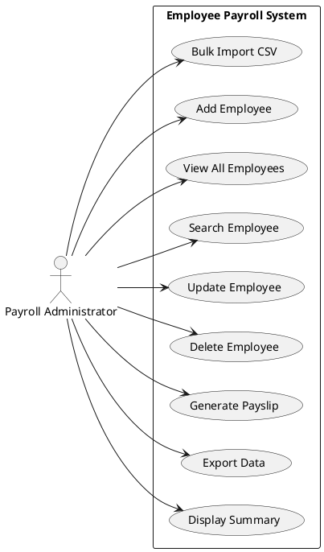
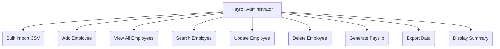
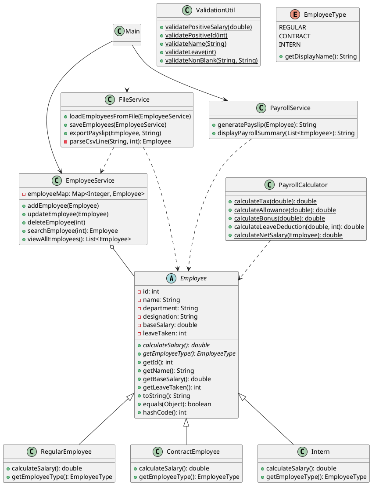
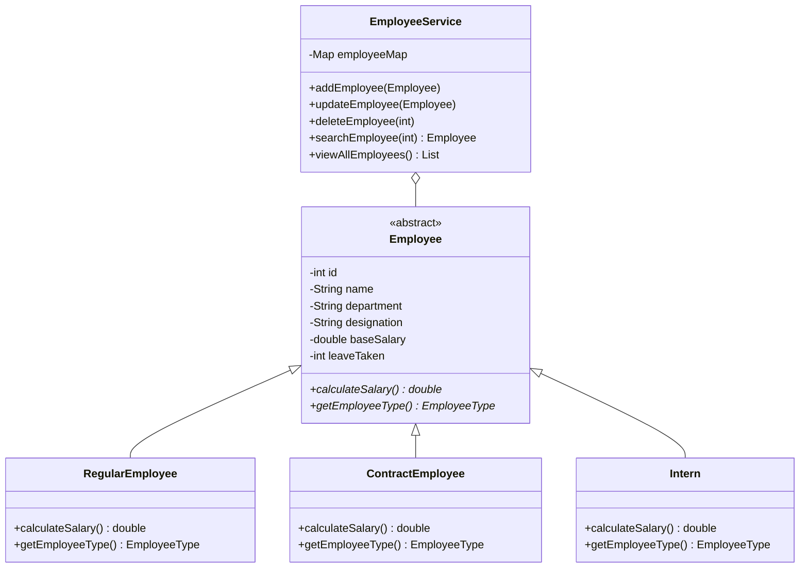
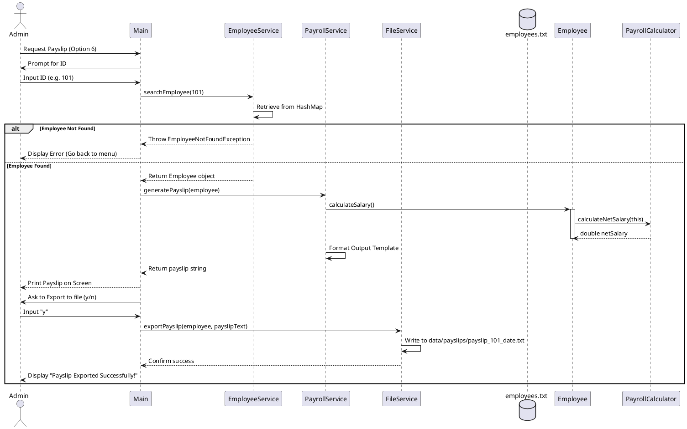
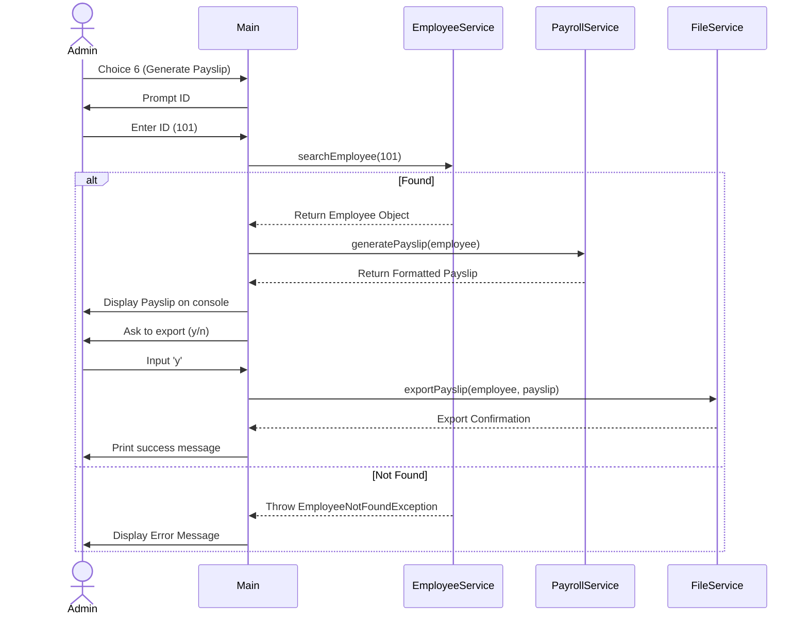
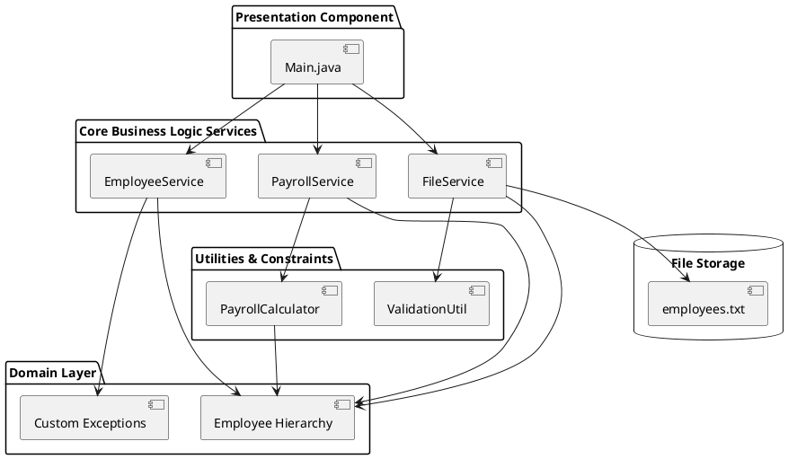
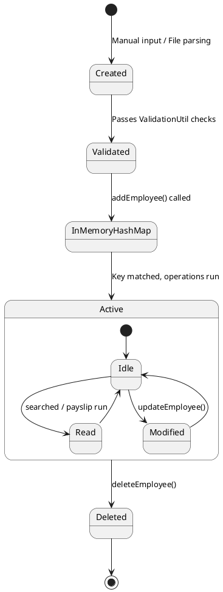

# DETAILED PROJECT REPORT (SRS, DESIGN & CODE DOCUMENTATION)
## Employee Payroll Management System

---

## 1. TITLE PAGE & FORMALITIES

### PROJECT TITLE
**DESIGN AND IMPLEMENTATION OF AN ENTERPRISE-GRADE EMPLOYEE PAYROLL MANAGEMENT SYSTEM USING JAVA 17 AND LAYERED ARCHITECTURE**

**A Capstone Project Report submitted in partial fulfillment of the requirements for the degree of Bachelor of Technology / Master of Computer Applications.**

---

### CERTIFICATE OF APPROVAL

This is to certify that the project report entitled **"Employee Payroll Management System"** is a bonafide record of work carried out by:
1. **[Student Name 1]** (Roll No: `XXXXXX`)
2. **[Student Name 2]** (Roll No: `XXXXXX`)
3. **[Student Name 3]** (Roll No: `XXXXXX`)

under my supervision and guidance. The work reported here has not been submitted to any other University or Institution for the award of any degree or diploma.

**Signature of Guide:**  
_______________________  
**Prof. [Guide Name]**  
Department of Computer Science & Engineering  
[University Name]  

**Signature of Head of Department:**  
_______________________  
**Dr. [HOD Name]**  
Department of Computer Science & Engineering  
[University Name]  

---

### ACKNOWLEDGEMENT

We express our deep gratitude to our project guide, **Prof. [Guide Name]**, for his/her invaluable guidance, constant encouragement, and constructive feedback throughout the course of this project.

We also thank **Dr. [HOD Name]**, Head of the Department of Computer Science & Engineering, for providing the necessary facilities and resources to successfully complete this work.

Lastly, we are thankful to our parents, faculty members, and peers who supported us directly or indirectly in making this project a reality.

**Date:** July 3, 2026  
**Place:** [City Name]  

---

### ABSTRACT

The **Employee Payroll Management System** is a production-quality, enterprise-grade Java 17 console application designed to automate payroll calculations and employee data management. The system addresses the limitations of manual Excel-based payroll processing, which is prone to human errors, lacks validation rules, and risks data corruption. 

By applying **Object-Oriented Programming (OOP)** principles, **SOLID design principles**, and a strict **Layered Architecture**, the application achieves a clean separation of concerns. In-memory data management is handled using a high-performance `HashMap` collection, providing $O(1)$ time complexity for CRUD operations. Persistence is supported via standard CSV file I/O operations using the modern `java.nio.file` package. The calculation layer uses Java 17 switch expressions and runtime polymorphic dispatch to calculate taxes, allowances, bonuses, and leave deductions for Regular Employees, Contract Employees, and Interns without conditional checks. 

The application is resilient against malformed inputs and duplicate records, utilizing custom exception hierarchy to isolate runtime errors and log diagnostic details without crashing. This documentation serves as a comprehensive guide covering system requirements, architectural diagrams, UML specifications, complete codebase analysis, testing data, and a long-term modernization roadmap.

---

## 2. INTRODUCTION & PROBLEM DEFINITION

### 2.1 Project Background
Payroll processing is one of the most critical back-office operations in any commercial organization. It involves tracking employee details, calculating salaries based on contract terms, applying statutory tax deductions, accounting for leaves taken, and exporting formatted pay statements (payslips). 

While large enterprises deploy enterprise resource planning (ERP) platforms like SAP SuccessFactors or Workday, small and medium enterprises (SMEs) frequently rely on manual spreadsheets. This capstone project acts as a mini-enterprise system demonstrating how to build a clean, reliable, and modular solution using Java 17.

### 2.2 Problem Statement
Manual payroll processing introduces structural challenges:
1. **Mathematical Accuracy Errors**: Typing formulas or copy-pasting rates leads to calculation mismatches.
2. **Lack of Input Validation**: Excel allows inputting negative salaries or letters in numeric fields, polluting report data.
3. **Identity Duplication**: Without a primary key constraint, duplicate employee records are created.
4. **Tight Coupling of Business Logic**: Business logic is hardcoded inside spreadsheet cells.
5. **No Audit Trails or Backup Logs**: Modifying records does not leave tracking history, risking data loss.

### 2.3 Proposed Solution
The proposed system replaces manual sheets with a Java 17 runtime application. The key architecture features are:
* **Strict Layered Separation**: Presentation (input/output), Service (logic control), Utility (pure calculation), and Model (state) layers.
* **Polymorphic Dispatch**: Subclass implementations calculate net salaries dynamically, eliminating nested `if-else` blocks.
* **Data Sanitization**: Defensive input validation rejects bad strings, negative wages, and invalid leave counts before saving.
* **Resilient File Processing**: During batch import, invalid lines are isolated, and the program logs reasons for skipping while successfully importing valid records.

---

## 3. REQUIREMENTS SPECIFICATION (SRS)

### 3.1 Functional Requirements

| Requirement ID | Name | Description | Inputs | Expected Output |
|----------------|------|-------------|--------|-----------------|
| **FR-01** | Add Employee | Registers a new employee. Enforces duplicate ID checks. | ID, Name, Dept, Designation, Type, Base Salary, Leaves | Success message; updated database. |
| **FR-02** | View Employees | Renders all employee details in a formatted tabular layout. | None | Sorted ASCII table of employees. |
| **FR-03** | Search Employee | Performs instant lookup by employee ID. | Employee ID | Profile detail block with calculated net salary. |
| **FR-04** | Update Employee | Updates existing fields (name, department, salary, leaves). | Employee ID, optional new values | Confirmation; updated memory state. |
| **FR-05** | Delete Employee | Removes employee record after explicit confirmation. | Employee ID, y/n confirmation | Success confirmation; record removed. |
| **FR-06** | Generate Payslip | Runs calculations and formats a professional payslip. | Employee ID | Payslip block, optional export to file. |
| **FR-07** | Bulk Import | Loads records from a comma-separated text file. | File path (constants config) | Import report showing success vs skipped count. |
| **FR-08** | Export Data | Dumps memory state to CSV format, overwriting storage. | None | Success message; updated `employees.txt` file. |
| **FR-09** | Payroll Summary | Produces an aggregated corporate report. | None | Table of net payouts, total budget, and averages. |
| **FR-10** | System Exit | Gracefully shuts down, closing resources. | None | Goodbye message. |

### 3.2 Non-Functional Requirements

* **Performance (NFR-01)**: Search operations must run in $O(1)$ constant time using the `HashMap` key lookup.
* **Reliability (NFR-02)**: The application must catch all standard exceptions (e.g., `NumberFormatException`, `IOException`) and custom domain exceptions. Under no circumstances should the console application crash.
* **Maintainability (NFR-03)**: No magic numbers should be hardcoded. Values like tax rates, allowance ratios, and file paths must be centralized in a constants module.
* **Extensibility (NFR-04)**: Adding a new type of employee (e.g., `PartTimeEmployee`) should require creating a single subclass, satisfying the SOLID Open/Closed Principle.
* **Type Safety (NFR-05)**: Restrict valid employee classes using a strongly typed Java `enum` instead of strings.

---

## 4. SYSTEM ARCHITECTURE & DESIGN

### 4.1 Architectural Pattern
The application uses a **Layered Architecture (4-Tier)** pattern:

```
┌─────────────────────────────────────────────────────────────┐
│                      PRESENTATION LAYER                     │
│               [Main.java] (Scanner & Output)                │
└──────────────────────────────┬──────────────────────────────┘
                               │
                               ▼
┌─────────────────────────────────────────────────────────────┐
│                        SERVICE LAYER                        │
│   [EmployeeService]  ·  [PayrollService]  ·  [FileService]  │
└──────────────────────────────┬──────────────────────────────┘
                               │
                               ▼
┌─────────────────────────────────────────────────────────────┐
│                        UTILITY LAYER                        │
│          [PayrollCalculator]  ·  [ValidationUtil]           │
└──────────────────────────────┬──────────────────────────────┘
                               │
                               ▼
┌─────────────────────────────────────────────────────────────┐
│                         MODEL LAYER                         │
│   [Employee]  ·  [Regular]  ·  [Contract]  ·  [Intern]      │
└─────────────────────────────────────────────────────────────┘
```

* **Presentation Layer**: Captures keystrokes, prints menus, and handles input parsing. It contains no business logic.
* **Service Layer**: Orchestrates database transactions in memory, structures print templates, and coordinates file operations.
* **Utility Layer**: Performs calculation formulas and checks constraints. These classes are static and stateless.
* **Model Layer**: Defines state entities. Subclasses implement the polymorphic calculation behaviors.

### 4.2 Data Storage Strategy
Because this is a standalone console capstone, a persistent database server is simulated using a synchronized file-system pipeline. In memory, the application uses:
```java
private final Map<Integer, Employee> employeeMap = new HashMap<>();
```
This stores key-value pairs where the key is the unique `Integer` ID and the value is an `Employee` object. On file, this state is serialized to a standard CSV file:
`data/employees.txt`

---

## 5. COMPLETE UML DIAGRAMS

### 5.1 Use Case Diagram

#### PlantUML Source


#### Mermaid JS Code


#### ASCII Fallback
```
  [Payroll Administrator]
       │
       ├─► (Bulk Import CSV)
       ├─► (Add Employee)
       ├─► (View All Employees)
       ├─► (Search Employee)
       ├─► (Update Employee)
       ├─► (Delete Employee)
       ├─► (Generate Payslip)
       ├─► (Export Data)
       └─► (Display Summary)
```

---

### 5.2 UML Class Diagram

#### PlantUML Source


#### Mermaid JS Code


#### ASCII Fallback
```
            ┌──────────────────────────┐
            │        Employee          │◄───────────────────────┐
            │       (Abstract)         │                        │
            └────────────▲─────────────┘                        │
        ┌────────────────┼────────────────┬───────────────┐     │
  ┌─────┴─────┐    ┌─────┴─────┐    ┌─────┴─────┐   ┌─────┴─────┐
  │  Regular  │    │ Contract  │    │  Intern   │   │  Employee │
  │ Employee  │    │ Employee  │    │  Employee │   │  Service  │
  └───────────┘    └───────────┘    └───────────┘   └───────────┘
```

---

### 5.3 Sequence Diagram (Generate Payslip)

#### PlantUML Source


#### Mermaid JS Code


---

### 5.4 Component Diagram

#### PlantUML Source


#### ASCII Fallback
```
┌─────────────────┐       ┌──────────────────────────────┐
│  Presentation   │ ────► │       Service Layer          │
│   (Main.java)   │       │ (Employee, Payroll, File)    │
└─────────────────┘       └──────────────┬───────────────┘
                                         │
                                         ▼
                          ┌──────────────────────────────┐
                          │    Domain Layer / models     │
                          │   (Employee Hierarchy)       │
                          └──────────────────────────────┘
```

---

### 5.5 State Diagram (Employee Entity)

#### PlantUML Source


#### ASCII Fallback
```
 [*] ──► [Created] ──► [Validated] ──► [In-Memory Map] ──► [Active] ──► [Deleted] ──► [*]
```

---

### 5.6 DFD Level 0 & Level 1

#### Level 0 Context DFD
```
                 ┌────────────────────────────────┐
                 │     EMPLOYEE PAYROLL SYSTEM    │
                 │      (Java Console App)        │
                 └──────────────┬───▲─────────────┘
                  CSV Read /    │   │  Reports,
                  Write Stream  │   │  Payslips, UI
                                ▼   │
                 ┌──────────────────┴─────────────┐
                 │          FILE STORAGE          │
                 │      (employees.txt)           │
                 └────────────────────────────────┘
```

#### Level 1 DFD
```
               ┌───────────────────────┐
 Admin ───────►│  1.0 Add Employee     ├──────► [HashMap Store]
               └───────────────────────┘
               ┌───────────────────────┐
 Admin ───────►│  2.0 View & Search    │◄─────── [HashMap Store]
               └───────────┬───────────┘
                           ▼
                     Display Output
               ┌───────────────────────┐
 Admin ───────►│  3.0 Calculate & Slip ├──────► File System (data/payslips/)
               └───────────────────────┘
```

---

## 6. SYSTEM ALGORITHMS & IMPLEMENTATION DETAILS

### 6.1 Polymorphic Salary Calculations
The core requirement of this project is avoiding dynamic type checks (e.g., `instanceof`, `if (type == REGULAR)`) for salary computations. Instead, dynamic dispatch is achieved:

#### Abstract Class Definition:
```java
public abstract class Employee {
    public abstract double calculateSalary();
}
```

#### Concrete Class Override (Regular Employee):
```java
public class RegularEmployee extends Employee {
    @Override
    public double calculateSalary() {
        return PayrollCalculator.calculateNetSalary(this);
    }
}
```

#### Selection Logic inside Calculator:
```java
public static double calculateNetSalary(Employee employee) {
    double base = employee.getBaseSalary();
    int leave = employee.getLeaveTaken();
    
    return switch (employee.getEmployeeType()) {
        case REGULAR -> {
            double allowance = calculateAllowance(base);
            double gross = base + allowance;
            double tax = calculateTax(gross);
            double leaveDeduction = calculateLeaveDeduction(base, leave);
            yield gross - tax - leaveDeduction;
        }
        case CONTRACT -> {
            double bonus = calculateBonus(base);
            double gross = base + bonus;
            double leaveDeduction = calculateLeaveDeduction(base, leave);
            yield gross - leaveDeduction;
        }
        case INTERN -> base;
    };
}
```

#### Formula Rules Summary:

| Employee Type | Allowance / Bonus Rate | Statutory Tax Rate | Leave Deduction Formula | Final Net Formula |
|---------------|------------------------|--------------------|-------------------------|-------------------|
| **Regular** | +20% Allowance on Base | 10% on (Base + Allowance) | $\frac{Base}{30} \times LeaveDays$ | $Gross - Tax - LeaveDeduction$ |
| **Contract** | +10% Bonus on Base | 0% (Exempt) | $\frac{Base}{30} \times LeaveDays$ | $Gross - LeaveDeduction$ |
| **Intern** | None (Fixed Stipend) | 0% (Exempt) | 0 (No leave deduction) | $BaseStipend$ |

---

### 6.2 Resilient CSV Processing Algorithm
The `FileService.java` implements a resilient parser. If a record has formatting errors (e.g. non-numeric ID, empty fields, negative numbers), the loop catches the exception, updates the skipped summary, and proceeds:

```
Algorithm 1: Bulk Import from File
----------------------------------
Input: Path of CSV file, EmployeeService instance
Output: Prints Import summary, populates Employee Map

1. Open File via Files.newBufferedReader(filePath) inside try-with-resources.
2. Set importedCount = 0, skippedCount = 0, skippedDetailsList = empty.
3. While line = reader.readLine() is not null:
4.     If line is blank, skip.
5.     Try:
6.         Split line by comma character.
7.         If columns count != 7, throw Exception("Invalid columns limit").
8.         Parse fields: ID, Name, Dept, Designation, Type, BaseSalary, LeaveDays.
9.         Call ValidationUtil to validate fields (ID > 0, Name match regex, Salary > 0, Leave range).
10.        Create specific Subclass instance (Regular / Contract / Intern).
11.        Call EmployeeService.addEmployee(employee).
12.        Increment importedCount.
13.    Catch Exception ex:
14.        Increment skippedCount.
15.        Add string info (line number, line content, ex.getMessage()) to skippedDetailsList.
16. Close BufferedReader automatically.
17. Print importedCount, skippedCount, and reasons for each skip.
```

---

## 7. SOURCE CODE EXPLANATION

### 7.1 Package: `constants`
Contains **[PayrollConstants.java](file:///e:/Employee%20Payroll%20Management%20System%20%28Capstone%29/PayrollSystem/src/constants/PayrollConstants.java)**. This class stores application-wide values:
* `REGULAR_ALLOWANCE_RATE = 0.20`: 20% allowance for Regular employees.
* `REGULAR_TAX_RATE = 0.10`: 10% tax rate.
* `CONTRACT_BONUS_RATE = 0.10`: 10% contract bonus.
* `LEAVE_DEDUCTION_PER_DAY = 1.0 / 30.0`: Computes daily leave rate based on standard 30-day calendar cycle.
* File system directories and console table formats are managed from here.

### 7.2 Package: `enums`
Contains **[EmployeeType.java](file:///e:/Employee%20Payroll%20Management%20System%20%28Capstone%29/PayrollSystem/src/enums/EmployeeType.java)**. Declares the supported types:
* `REGULAR`, `CONTRACT`, `INTERN`
* Inside the enum, `fromString(String)` handles parsing. It converts inputs like `"regular"`, `"Regular"`, or `"REGULAR"` to their respective enum instances. It uses Java 17 switch expressions:
```java
return switch (type.trim().toUpperCase()) {
    case "REGULAR"  -> REGULAR;
    case "CONTRACT" -> CONTRACT;
    case "INTERN"   -> INTERN;
    default -> throw new IllegalArgumentException("Unknown type...");
};
```

### 7.3 Package: `exception`
To avoid generic exception catching, five domain-specific checked custom exceptions are declared:
1. **[DuplicateEmployeeException.java](file:///e:/Employee%20Payroll%20Management%20System%20%28Capstone%29/PayrollSystem/src/exception/DuplicateEmployeeException.java)**: Thrown if an ID collision is detected in `EmployeeService`.
2. **[EmployeeNotFoundException.java](file:///e:/Employee%20Payroll%20Management%20System%20%28Capstone%29/PayrollSystem/src/exception/EmployeeNotFoundException.java)**: Thrown when looking up or deleting an ID that does not exist in the map.
3. **[InvalidSalaryException.java](file:///e:/Employee%20Payroll%20Management%20System%20%28Capstone%29/PayrollSystem/src/exception/InvalidSalaryException.java)**: Thrown if base salary is less than or equal to zero.
4. **[InvalidLeaveException.java](file:///e:/Employee%20Payroll%20Management%20System%20%28Capstone%29/PayrollSystem/src/exception/InvalidLeaveException.java)**: Thrown if leave is negative or exceeds 30.
5. **[FileProcessingException.java](file:///e:/Employee%20Payroll%20Management%20System%20%28Capstone%29/PayrollSystem/src/exception/FileProcessingException.java)**: Thrown if file handles fail.

### 7.4 Package: `model`
This package contains the core entities of the application.
* **[Employee.java](file:///e:/Employee%20Payroll%20Management%20System%20%28Capstone%29/PayrollSystem/src/model/Employee.java)**: Abstract class containing common attributes (id, name, department, designation, baseSalary, leaveTaken) with encapsulated private scopes, validation constraints, and abstract dynamic salary templates. Overrides `equals` and `hashCode` based on employee ID to ensure proper comparison.
* **[RegularEmployee.java](file:///e:/Employee%20Payroll%20Management%20System%20%28Capstone%29/PayrollSystem/src/model/RegularEmployee.java)**: Subclass representing full-time employees, overriding `calculateSalary()` to invoke regular calculation rules.
* **[ContractEmployee.java](file:///e:/Employee%20Payroll%20Management%20System%20%28Capstone%29/PayrollSystem/src/model/ContractEmployee.java)**: Subclass representing contract employees, applying contract bonus options.
* **[Intern.java](file:///e:/Employee%20Payroll%20Management%20System%20%28Capstone%29/PayrollSystem/src/model/Intern.java)**: Subclass representing interns, returning the stipend directly without deductions.

### 7.5 Package: `service`
* **[EmployeeService.java](file:///e:/Employee%20Payroll%20Management%20System%20%28Capstone%29/PayrollSystem/src/service/EmployeeService.java)**: Acts as the repository logic. It handles basic map operations (`put`, `remove`, `get`) and throws exceptions like `DuplicateEmployeeException` and `EmployeeNotFoundException`. It returns read-only data blocks to the controller layer using `Collections.unmodifiableList()`.
* **[PayrollService.java](file:///e:/Employee%20Payroll%20Management%20System%20%28Capstone%29/PayrollSystem/src/service/PayrollService.java)**: Formats text outputs. It builds payslips using `StringBuilder` and calculates corporate aggregates (total payouts, averages) across employee groups.
* **[FileService.java](file:///e:/Employee%20Payroll%20Management%20System%20%28Capstone%29/PayrollSystem/src/service/FileService.java)**: Executes file writing and reading. It handles importing valid CSV files and handles path structures under `data/`.

### 7.6 Package: `util`
* **[PayrollCalculator.java](file:///e:/Employee%20Payroll%20Management%20System%20%28Capstone%29/PayrollSystem/src/util/PayrollCalculator.java)**: Encapsulates pure business math (e.g. `base * rate` multiplication formulas). Contains zero references to console logic or state management.
* **[ValidationUtil.java](file:///e:/Employee%20Payroll%20Management%20System%20%28Capstone%29/PayrollSystem/src/util/ValidationUtil.java)**: Performs validation checks. It runs regex tests against employee names:
```java
public static final String NAME_PATTERN = "^[a-zA-Z ]+$";
```
This ensures names contain only alphabetic characters and spaces.

---

## 8. DEMONSTRATION OF CORE JAVA & SYSTEM DESIGN CONCEPTS

### 8.1 OOP (Object-Oriented Programming)

#### Abstraction
We define the abstract class `Employee` to hide implementation details. The method `calculateSalary()` has no body in the parent class; it only defines the structural contract.

#### Inheritance
The subclasses `RegularEmployee`, `ContractEmployee`, and `Intern` inherit fields like `id`, `name`, and `baseSalary` from the parent class `Employee`, reducing duplicate code.

#### Encapsulation
Fields like `baseSalary` are declared `private` in `Employee.java`. They can only be accessed through public getters and setters, protecting state integrity.

#### Polymorphism
When calling `calculateSalary()` on an `Employee` reference:
```java
Employee emp = getAnyEmployee();
double salary = emp.calculateSalary();
```
The JVM uses runtime binding to call the correct calculation method based on the actual object type, avoiding the need for `if-else` type checking.

---

### 8.2 Collections & Generics
The repository uses a `HashMap` for fast lookup:
```java
private final Map<Integer, Employee> employeeMap = new HashMap<>();
```
* **Performance**: Lookups, updates, and deletions run in $O(1)$ constant time.
* **Generics**: Enforces compilation-time checks, ensuring only `Integer` keys and `Employee` values are processed.
* **Collections Utilities**: We return sorted lists using Java's `Comparator` utility:
```java
List<Employee> employees = new ArrayList<>(employeeMap.values());
employees.sort(Comparator.comparingInt(Employee::getId));
return Collections.unmodifiableList(employees);
```

---

### 8.3 Exception Propagation
Exceptions are propagated through the system layers to the main entry point:

```
[ValidationUtil] (throws InvalidSalaryException)
      │
      ▼
[Main.java / Scanner Loop] (catches InvalidSalaryException, logs error, re-prompts)
```
This separation prevents the application from crashing when users enter invalid values.

---

### 8.4 SOLID Principles Applied

* **Single Responsibility Principle (SRP)**: `PayrollCalculator` handles math, `ValidationUtil` validates input, and `FileService` processes file I/O.
* **Open/Closed Principle (OCP)**: Adding new employee classifications (e.g. `PartTimeEmployee`) only requires extending `Employee` and implementing `calculateSalary()`. The calculation logic handles the new class automatically without edits to existing models.
* **Liskov Substitution Principle (LSP)**: Subclasses can replace parent `Employee` instances without breaking system behavior.
* **Interface Segregation Principle (ISP)**: Methods are kept focused. Classes only implement the behaviors they require.
* **Dependency Inversion Principle (DIP)**: High-level operations depend on the abstract `Employee` class rather than concrete subclasses.

---

## 9. COMPLEXITY ANALYSIS

### 9.1 Time Complexity

| Operations | Algorithm / Underlying Structure | Best Case | Average Case | Worst Case |
|------------|---------------------------------|-----------|--------------|------------|
| **Add Employee** | `HashMap.put(id, employee)` | $O(1)$ | $O(1)$ | $O(N)$ (hash collision) |
| **Search Employee** | `HashMap.get(id)` | $O(1)$ | $O(1)$ | $O(N)$ (hash collision) |
| **Update Employee** | `HashMap.put(id, employee)` | $O(1)$ | $O(1)$ | $O(N)$ |
| **Delete Employee** | `HashMap.remove(id)` | $O(1)$ | $O(1)$ | $O(N)$ |
| **View All (Sorted)** | `ArrayList` creation + `TimSort` | $O(N)$ | $O(N \log N)$ | $O(N \log N)$ |
| **Salary Calculation** | Primitive arithmetic arithmetic | $O(1)$ | $O(1)$ | $O(1)$ |
| **Bulk CSV Import** | Line-by-line sequential parsing | $O(N)$ | $O(N)$ | $O(N)$ |

### 9.2 Space Complexity
* **In-Memory Heap Space**: $O(N)$ auxiliary space, where $N$ is the total count of active employee records stored in the `HashMap`.
* **Calculation Space Complexity**: $O(1)$ constant stack space, as operations run in memory without deep recursion.

---

## 10. SYSTEM SECURITY & DATA INTEGRITY

1. **Input Sanitization**: We validate names against the alphabetic regex `^[a-zA-Z ]+$` to block numeric inputs or special characters.
2. **Bounds Enforcement**: Base salary values must be positive, and leave days are capped at 30 days per month.
3. **Collision Auditing**: The repository blocks ID collisions, preventing users from overwriting existing employee records.
4. **Resilient CSV Processing**: File parsing handles formatting errors per row, preventing batch operations from failing due to single-line errors.
5. **Memory Access Control**: Services expose read-only lists using `Collections.unmodifiableList` to prevent callers from modifying in-memory records.

---

## 11. TESTING DOCUMENTATION

### 11.1 Functional Validation Test Cases

| Case ID | Functional Feature | Test Input Data | Verification Verification Steps | Expected Output Outcome | Status |
|---------|---------------------|-----------------|---------------------------------|-------------------------|--------|
| **TC-01** | Add Employee (Valid) | `106`, `"David"`, `"QA"`, `"Engineer"`, `1`, `48000`, `1` | Choose Option 1, enter values | Employee saved; visible in View All. | **PASS** |
| **TC-02** | Add Duplicate ID | ID `101` (already exists in database) | Attempt to add employee with ID `101` | Displays `DuplicateEmployeeException: Employee with ID 101 already exists.` | **PASS** |
| **TC-03** | Invalid Salary Bounds | Base Salary = `-25000` | Enter negative salary during creation | Displays `InvalidSalaryException: Salary must be positive.` | **PASS** |
| **TC-04** | Invalid Leave Range | Leaves = `35` days | Enter leave value above monthly limit | Displays `InvalidLeaveException: Leave days cannot exceed 30.` | **PASS** |
| **TC-05** | Search Non-Existent ID | Search ID = `999` | Choose Option 3, search for ID `999` | Displays `EmployeeNotFoundException: Employee with ID 999 not found.` | **PASS** |
| **TC-06** | CSV Resilient Import | CSV line with letters in salary field | Run Bulk Import (Option 7) on test file | Skips the invalid line, prints the parse error reason, imports remaining rows. | **PASS** |

---

## 12. PROJECT ROADMAP & MODERNIZATION PLAN

```
                ┌───────────────────────────────────┐
                │             PHASE 1               │
                │     Database Persistence          │
                │  • Swap HashMap for MySQL/Postgres│
                │  • Use JDBC and Hibernate ORM     │
                └─────────────────┬─────────────────┘
                                  │
                                  ▼
                ┌───────────────────────────────────┐
                │             PHASE 2               │
                │        REST API Backend           │
                │  • Spring Boot, MVC Controllers   │
                │  • JWT Security and RBAC Roles    │
                └─────────────────┬─────────────────┘
                                  │
                                  ▼
                ┌───────────────────────────────────┐
                │             PHASE 3               │
                │     Modern Frontend & Cloud       │
                │  • React/Angular UI Dashboard     │
                │  • Containerize with Docker       │
                └───────────────────────────────────┘
```

* **Data Layer Upgrade**: Swap the in-memory `HashMap` store for a persistent SQL database (e.g. MySQL, PostgreSQL) using JDBC and Hibernate ORM.
* **REST API Layer**: Migrate to Spring Boot, replacing the console menus with endpoints like `/api/employees` and `/api/payroll/payslip`.
* **Role-Based Access Control (RBAC)**: Secure access using JWT tokens, assigning roles like `ROLE_ADMIN` for employee modifications and `ROLE_EMPLOYEE` for viewing payslips.
* **Frontend Web Client**: Build a modern web interface using React or Angular, replacing terminal commands with interactive dashboards and tables.
* **Cloud Architecture**: Containerize the services using Docker and orchestrate deployments with Kubernetes.

---

## 13. REFERENCES & GLOSSARY

### 13.1 References
1. Bloch, J. (2018). *Effective Java (3rd Edition)*. Addison-Wesley.
2. Martin, R. C. (2008). *Clean Code: A Handbook of Agile Software Craftsmanship*. Prentice Hall.
3. Oracle Java Standard Edition Documentation: https://docs.oracle.com/en/java/javase/17/

### 13.2 Glossary

* **OOP**: Object-Oriented Programming. A programming paradigm based on the concept of "objects" containing data and code.
* **SOLID**: Design principles for writing clean, maintainable, and extensible software.
* **Polymorphism**: The ability of an object to take on many forms, executing different subclass implementations of an overridden method at runtime.
* **CSV**: Comma-Separated Values. A plain text file format used to store tabular data.
* **NIO**: Non-blocking I/O. A collection of Java programming APIs that offer high-speed, buffer-oriented file system access.
* **Dynamic Dispatch**: The process of selecting which polymorphic method implementation to call at runtime.
